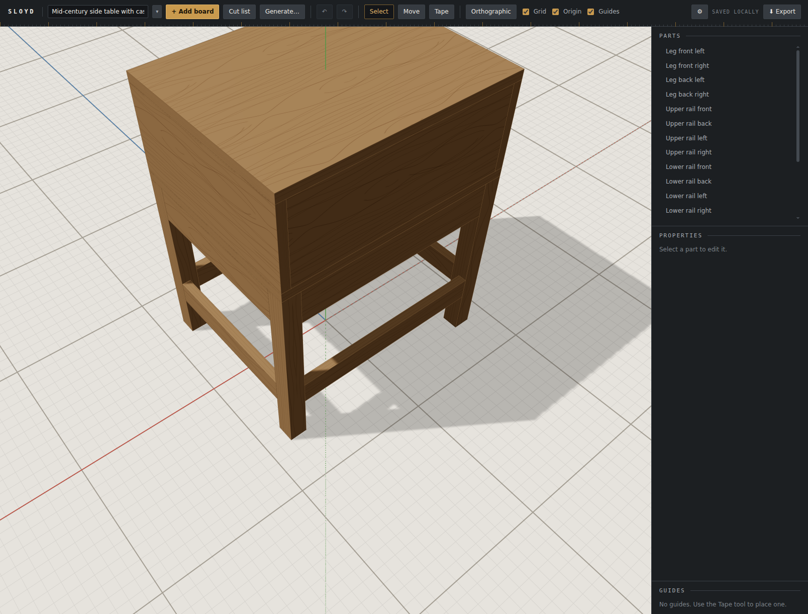
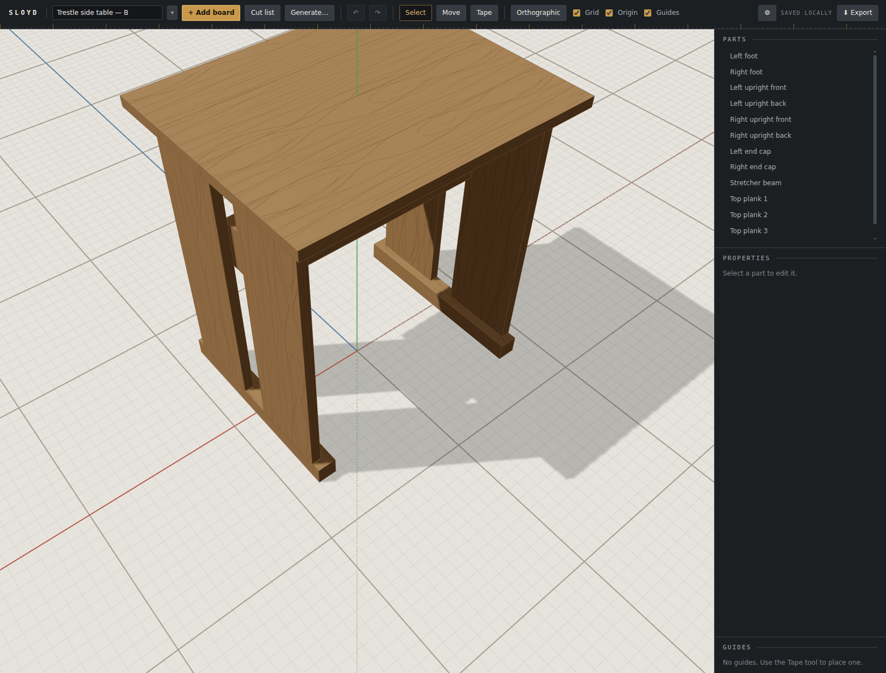
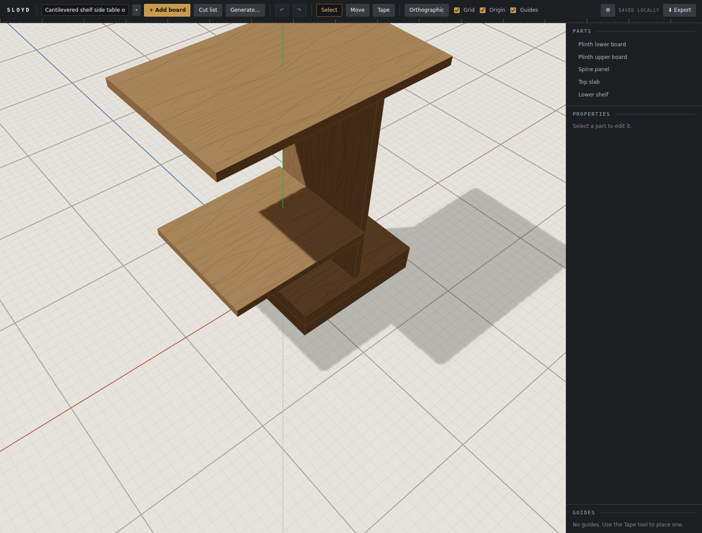
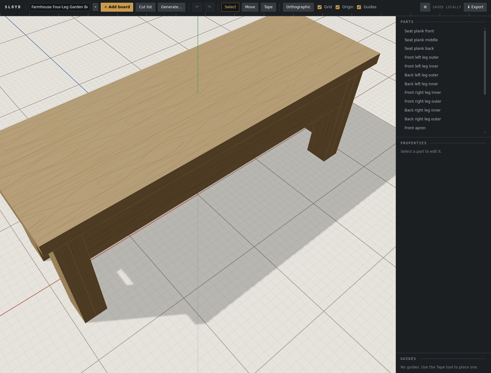
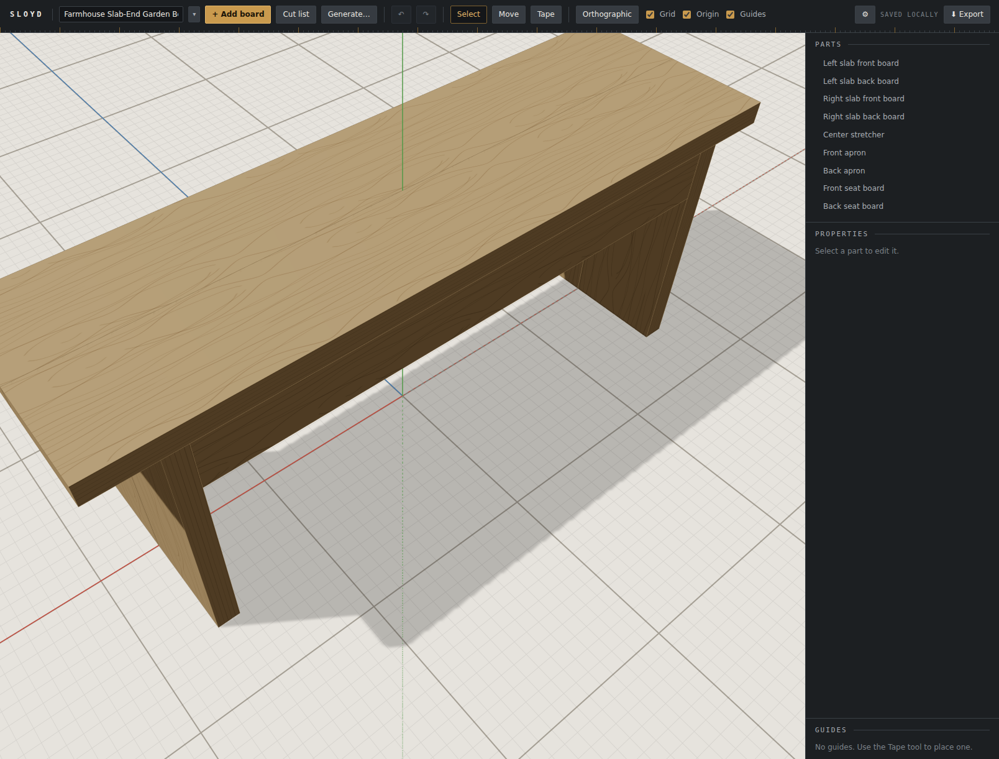
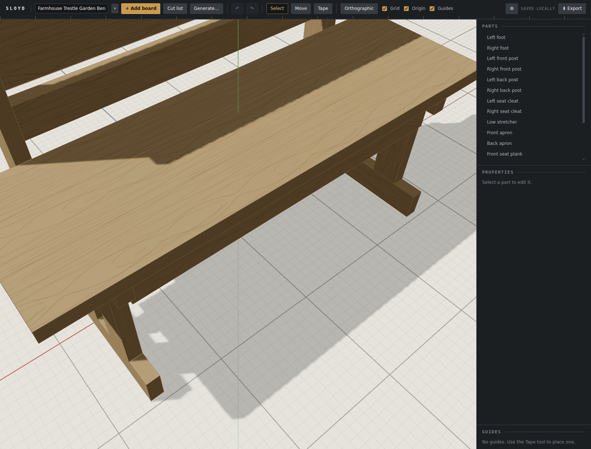

# Browser verification: batch variety

Follow-up 164. A Generate batch of 2–3 used to send N identical requests. In the Generate
round's live pass, three Sonnet side tables came back as **one design three times**,
differing only in stretcher width. This round adds one planning call
(`src/generate/concepts.ts`) that proposes N structurally contrasting concepts, and each run
designs its own. The question for this pass is the one only a live run can answer: **do the
designs now differ in structure?** The user judged that, watching.

## How this was driven

Claude drove the dev server with the Playwright MCP (`npm run dev -- --host 127.0.0.1
--port 5180`, Chromium, software GL), and **the user watched the same browser**. This is the
route the Generate round's record named for next time, and it is the first round to use it.
The user entered the key into Settings themselves. Its value never appeared in chat, in a
tool call, or in any file.

The key took three attempts, and the record of those is worth keeping:

- **The first two pastes were not valid keys.** One was 248 characters with whitespace and
  non-ASCII characters; one was 212 characters. The API answered 401 *"API key is invalid."*
  Both times the **planning call was the only call made**, which is this round's own §4
  working as designed: a rejected key during planning fails every row with the key message
  and starts no run, so nothing was charged.
- **A third paste failed the same way.** The user then made a new key, which worked.
- **A claim made during the diagnosis was wrong, and is corrected here.** Claude told the
  user a standard key starts with `sk-ant-api`. The key that worked does **not**. Any key
  check added to Settings (follow-up 174) must not require that prefix. Whitespace inside
  the key, and characters outside printable ASCII, are what actually told the two bad
  pastes apart.

For the duration of the runs, a **temporary fetch wrapper** was installed in the page (via
`browser_evaluate`, not in the source). It recorded each request's model, its turn count,
the concept line in the first message, and the usage fields from the response stream. It
read request **bodies** only, never headers, so the key was never captured. Closing the
browser at the end removed it.

**A batch of 1 was seen live too.** The user ran one themselves while checking the new key:
one request, no planning call, no concept line, project named `Side table` with no letter
suffix. That matches the spec's "a batch of 1 is unchanged".

## Batch 1: side table (Sonnet 5.5): oak, Mid-century, Detailed, 3

The same settings that produced three identical tables last round.

| | Concept (title — brief) | Parts | Calls | Cost |
|---|---|---|---|---|
| Plan | — | — | 1 | ≈ $0.00 (113 in / 279 out) |
| A | **Case on open leg frame** — a shallow case box (top, bottom, sides, back) on a separate base of four square legs joined by upper and lower rails, so the case floats above the floor | 18 | 1 | ≈ $0.02 |
| B | **Trestle ends with slab top** — two panel ends, each a vertical board pair on a foot block, a stretcher beam between them, a plank-built top across them | 13 | 1 | ≈ $0.01 |
| C | **Cantilevered shelf on spine plinth** — one central spine panel on a low stacked-board plinth, carrying a top slab and an offset lower shelf as cantilevers | 5 | 1 | ≈ $0.00 |

## Batch 2: garden bench (Opus 5.5): pine, Farmhouse, Moderate, max width 60, 3

The user's prompt was "a bench"; Claude chose the details.

| | Concept | Parts | Calls | Cost |
|---|---|---|---|---|
| Plan | — | — | 1 | ≈ $0.01 (140 in / 283 out) |
| A | **Four-leg apron bench** — chunky legs laminated from stacked boards, a box apron, a heavy plank seat | 19 | 1 | ≈ $0.05 |
| B | **Slab-end bench** — two wide laminated slab ends tied by a deep stretcher, the seat carried entirely by panels | 9 | 1 | ≈ $0.03 |
| C | **Trestle bench with backrest** — two H-trestles (foot, post, cleat), a low stretcher, a plank seat, posts extended to carry a backrest | 17 | 1 | ≈ $0.08 |

## Verdict

**The user judged both batches to differ in structure, which passes the round and closes
follow-up 164.** All six designs completed on their first call, with no repair round.
Both batches together cost roughly $0.20 at the app's prices.

## What the pass saw beyond the verdict

- **Bench A and B differ in principle but read alike from above.** Both are a long plank
  seat over aprons; the difference (legs versus slab ends) sits under the seat. The concepts
  were distinct, and the designs honoured them. Whether "distinct" should mean "distinct at
  a glance" is a question for later, not a defect. This is recorded in follow-up 164's
  closure.
- **Side table C is follow-up 165 again.** A top and shelf balanced on one spine pass
  `checkDesign`, because support is topological. The planner proposing a cantilever makes
  this weakness more likely to show up, not less.
- **Prompt caching works, contradicting follow-up 167's premise.** Every side-table run read
  **1,271 cached tokens**, because the user's earlier single run had written the cache.
  Every bench run read **0**: all three started together, before any of them had written
  it. So the system prompt *is* long enough to cache. The gap is the cold parallel start.
  Follow-up 167 is rewritten accordingly.
- **The `f` key did not visibly frame the larger designs** in these screenshots; the camera
  stayed close. The framing code (`CameraKeys.frame`) was read and looks sound, and how the
  keypress reached it in this scripted sequence was not investigated. This is recorded here
  only. It is not filed as a defect, because nothing was measured.

## What could not be confirmed

- **The billed dollars.** The costs are the app's estimates at its price table. The console
  bill was not compared (follow-up 168 still stands).
- **The fallback path live.** Planning succeeded both times, so the built-in roles were
  seen only in unit tests. The auth-during-planning path *was* seen live, three times.
- **Cancel during planning, live.** This is unit-tested, including the case where the cancel
  lands as planning resolves.

`localStorage` was cleared in the verifying browser afterward and read back empty
(`sloyd.llm.v1` is `null`). The browser was closed and the dev server stopped. No key file
was ever written.
