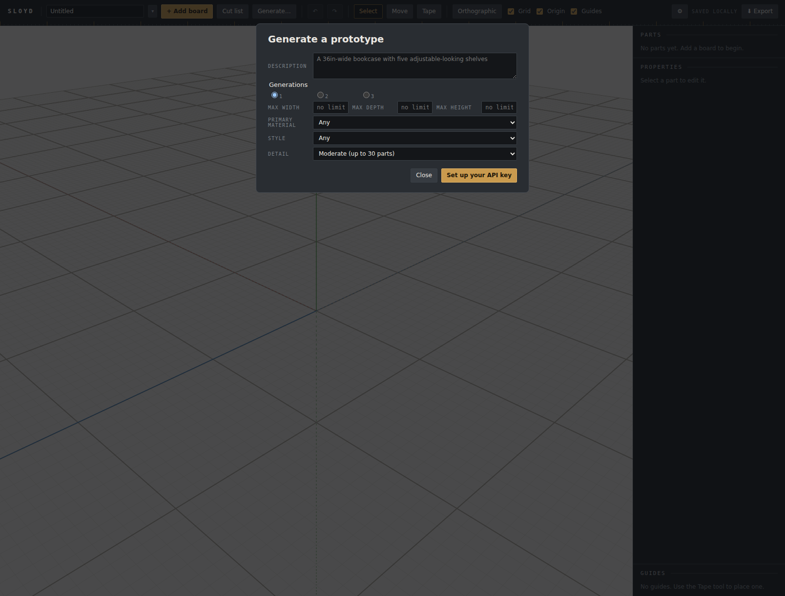
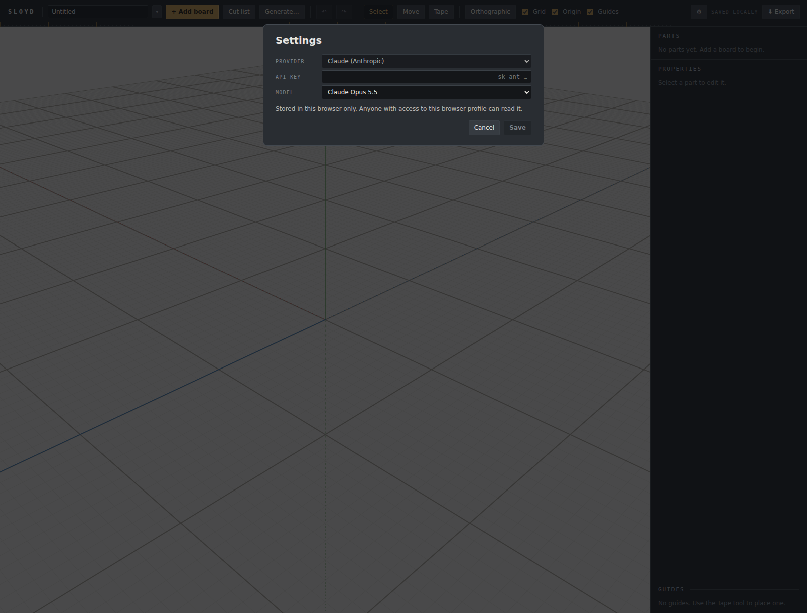

# Browser verification: Generate

The Generate round (2026-10-03): a description and a settings form go to Claude, each run
designs, is checked (`checkDesign`) and repaired up to three times, and each finished design
lands in the project library as a new, unactivated project (invariant 36).

This pass has two halves with different drivers, and they are recorded separately because
they buy different things.

1. **The no-key UI**, driven by Playwright MCP against the dev server. It costs nothing and
   needs no key.
2. **Real generations**, driven **by the user, against production**. This happened because
   the user expected not to reach the dev server through SSH, which is the 2026-08-15
   project-library precedent. **That premise was wrong, and the user corrected it
   afterward:** they can watch the Playwright browser this session drives. So the better
   route existed: Claude drives the dev server and the user supervises. That is the route
   for the next live test. The production run was still safe, for a reason the 08-15
   precedent lacked: **generation never writes into an existing project**. It only adds new
   library entries with `activate: false`, so the user's open project was never at risk.

## 1. The no-key UI — dev server

Playwright MCP against `npm run dev -- --host 127.0.0.1 --port 5180`, Chromium, software GL.
Invariant 26a is noted for completeness only, since nothing here touches a shader. The
browser started with a fresh library, an empty `Untitled`, and no `sloyd.llm.v1`.

| Check | How | Seen |
|---|---|---|
| Toolbar carries the entry points | button text read off the DOM | `Generate…` between *Cut list* and undo; `⚙` beside the save indicator |
| Generate opens as a modal | click, then read `[role=dialog]` | `aria-label="Generate"`, focus on `.modal-sheet`, `.app-shell.inert === true` |
| No-key state | dialog text | the primary button reads **Set up your API key** (screenshot below) |
| `m` behind the dialog does nothing | a real `keyboard.press('m')` with focus on the **sheet**, not in the textarea | the tool stayed **Select** |
| …and the control proves the check can fail | the same keypress with the dialog closed | the tool went to **Move** |
| Escape closes Generate | keydown on the focused sheet | dialog gone, `.app-shell.inert === false` |
| Settings opens as a modal | `⚙` click | provider *Claude (Anthropic)*; key field `type="password"`; Opus 5.5 / Sonnet 5.5; the stored-in-this-browser line; `.app-shell` inert |
| Escape closes Settings | keydown on the focused sheet | closed; nothing written (`sloyd.llm.v1` still `null`) |
| Console | full log | 0 errors. The warnings are the known THREE deprecations (`Clock`, `PCFSoftShadowMap`) plus llvmpipe `ReadPixels` stall notices |

The `m` row matters more than it looks, and spec §6.4 (corrected in `3ef06d4`) says why.
Typing into the textarea was never at risk, because `isTextEntry` returns first. The real
risk is a keypress while focus sits on the sheet or a button. That is the state the dialog
opens in, and the control row shows the keypress reaches `App`'s listener when no modal
guards it.

`localStorage` was cleared in the verifying browser afterward and read back empty. The
browser was closed and the dev server stopped.

**A cosmetic finding from the screenshot, recorded rather than fixed.** The *Generations*
legend renders in the body face, white and sentence case. Every other field label uses the
uppercase monospace label style, and the 1/2/3 radios spread across the row with their
digits set small. The max width/depth/height row is also cramped: three labels and three
inputs share the width the other rows give to one control, and the labels do not sit in
the label column. Both are filed as follow-up 170.

## 2. Real generations — production, driven by the user

Bundle `index-BAsxEohe.js`, commit `fa834dc`. Before the user started, the edge was
confirmed to serve CSP `connect-src 'self' https://api.anthropic.com`. That is the one thing
the dev server cannot show, because it sends no CSP at all.

The three plan prompts, as the user reported them:

| Prompt | Settings | Outcome |
|---|---|---|
| Bookcase, 36in wide | plywood, Shaker, max height 72, 2 generations, Opus 5.5 | **Both completed with no repair round.** Two usable bookcases, slightly different from each other |
| Simple workbench | Shop, Moderate, 1 generation, Sonnet 5.5 | **One repair round**, then completed. A very workable design that chose **MDF for the top** unprompted. **One piece was not quite properly supported** even though it passed `checkDesign` (follow-up 165) |
| Side table | oak, Mid-century, Detailed, 3 generations, **Sonnet 5.5** | **All three completed**: two needed one repair round and one needed two. **The three are essentially the same design**, differing only in stretcher width (follow-up 164) |

So 6 of 6 generations completed, 3 with no repair, 2 with one, 1 with two, and none used
the fourth call.

**What this pass could not confirm**, each one stated rather than implied:

- **The cost figures.** The user did not report the per-row estimates, so nothing here
  checks the cost arithmetic against a real bill. Follow-up 168.
- **`cache_read_input_tokens` on repair calls.** It was never observed. Ruling 18's
  expectation stands untested: the system prompt is probably below the minimum cacheable
  prefix. Follow-up 167.
- **The server-side fallback path.** No run reported a refusal, so the after-the-last-fallback
  parse has unit tests only.
- **Effort.** Plan Step 3 tunes `medium` only if Opus routinely leaves issues after four
  calls. No run came close, so `EFFORT` stays `medium` and no `high` comparison was run.
- **The failure rows** (auth error, cancel, all-attempts-exhausted). These are unit-tested
  in `useGenerations.test.tsx` and `GenerateDialog.test.tsx` and were not seen live.

The plan's deployment rule said generation is never exercised against production. That
rule was written to protect the user's data, and on the user's request it was set aside in
exactly the way that keeps the data safe. CLAUDE.md's deployment rule records the
exception and why it holds.
