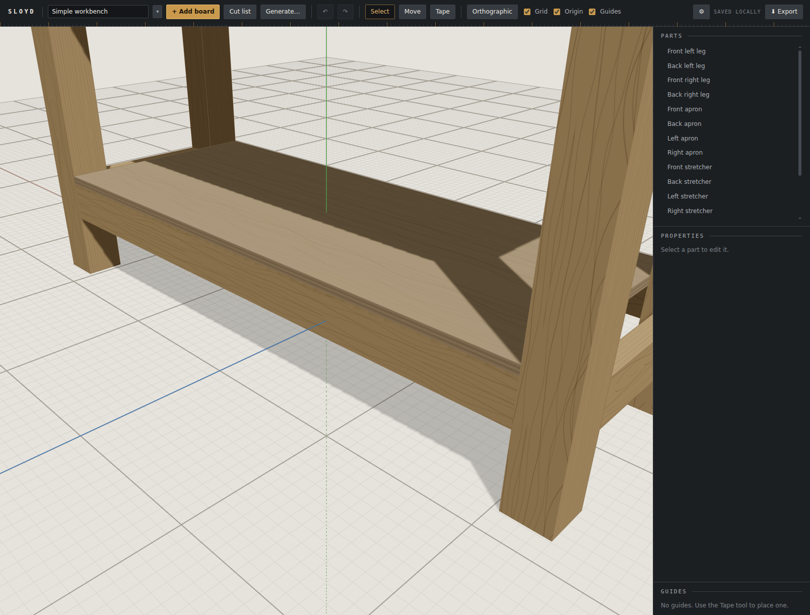
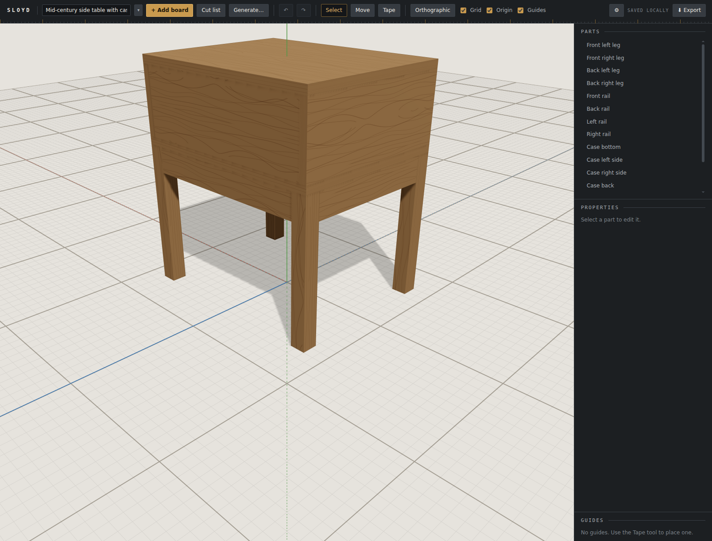
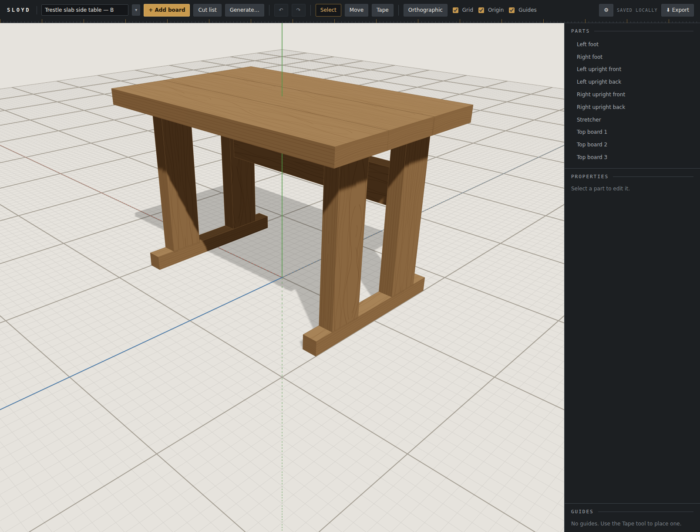
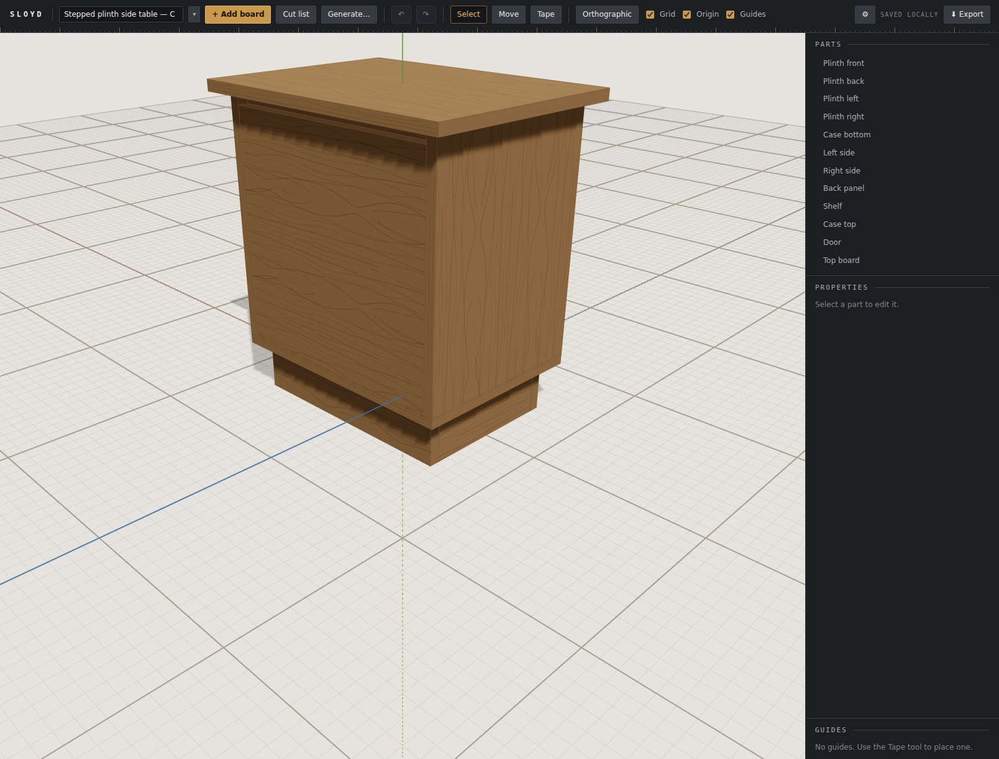

# Browser verification: held and stable

Follow-up 165. `checkDesign`'s old support rule was topological: any face contact counted, in
every direction. So the user's live workbench passed with its lower shelf hanging by four
corner patches **under** its low rails. This round adds `hangs` (every part off the floor
must be held: resting, between two parts covering ≥ 50% of each opposite side, or lapped on
a broad face) and `tips` (the grounded parts' volume-weighted centre of mass must sit at
least min(1in, s/4) inside the floor footprint). It also tells the model both rules up
front. The question for this pass is whether the rules hold in live generation without
rejecting sound designs, which would cost the user paid repair rounds for nothing.

## How this was driven

Claude drove the dev server with the Playwright MCP (`npm run dev -- --host 127.0.0.1
--port 5180`, Chromium, software GL) while **the user watched the same browser** and entered
the key into Settings. The key's value never appeared in chat, a tool call or a file. A free
`GET /v1/models` confirmed the key before any paid call.

**Two temporary instruments**, both in the page, both gone when the browser closed:

- **The fetch logger.** It read request **bodies only**, never headers. It recorded the
  model, the turn count, the concept line, **the text of every repair message**, and the
  usage fields from the response stream.
- **The real check, run on what was saved.** For each finished design the page imported
  `/src/document/designCheck.ts` and `/src/document/document.ts` from the dev server. It
  read the project back out of `localStorage`, passed it through `migrateDocument` and ran
  `checkDesign` on it. This is the shipped code against the stored document, not a
  re-derivation by hand.

## Run 1: "A simple workbench" (Shop, Moderate, 1, Sonnet 5.5)

This is the same request that produced the hanging shelf in the Generate round.

- **One call, no repair, ≈ $0.03** (78 in, 2,290 out, 0 cached; the cache was cold).
- **16 parts:** four legs; four aprons and four stretchers between the legs; a plywood lower
  shelf; three top planks.
- **The lower shelf now sits ON the stretchers.** It runs y 9.5–10.25 over stretchers at
  y 6–9.5, and spans between the front and back stretchers on Z. That is exactly the fix the
  old design needed, arrived at first time.
- **`checkDesign` on the stored document returned `[]`.**

## Run 2: "A side table" (oak, Mid-century, Detailed, 3, Sonnet 5.5)

This is the same batch that, in the batch variety pass, produced side table C, a top and
shelf cantilevered off one spine.

| | Concept | Parts | Calls | Repair sent | Cost | `checkDesign` |
|---|---|---|---|---|---|---|
| Plan | — | — | 1 | — | ≈ $0.00 (113 in / 276 out) | — |
| A | Case on open frame base | 15 | 1 | none | ≈ $0.02 | `[]` |
| B | Trestle slab table | 10 | 2 | *"Stretcher is not connected to the floor …; the nearest supported part is Left upright front, 0.75in away."* | ≈ $0.02 | `[]` |
| C | Stepped plinth cabinet | 12 | 2 | *"Case top is not connected … 0in away"* and *"Top board is not connected … 0.75in away"* | ≈ $0.03 | `[]` |

Every run read **1,385 cached tokens**, because the workbench run had warmed the cache. That
is 114 more than the batch variety pass's 1,271: the two new rule lines in `SYSTEM_PROMPT`.

## Verdict

**The user judged the designs sound, which passes the round and closes follow-up 165.** All
four finished designs check clean against the shipped code. The run cost about $0.10 in all.

## What this pass shows, and what it does not

- **The model obeys the rules up front.** Not one `hangs` or `tips` message was sent in five
  design calls; the two repairs were both the pre-existing `unsupported` check. The planner
  also proposed no cantilever this time. The two new prompt lines are the likely cause, but
  one batch cannot prove that.
- **No false positives were seen.** Nothing sound was rejected, so the rules cost no repair
  rounds on these designs. The final whole-branch review had already built a bookcase with a
  lapped back panel, a table with aprons and a cabinet on a plinth with an overlay door,
  and all passed clean.
- **NOT seen live: the model repairing a `hangs` or `tips` violation.** The checks and their
  exact messages are unit-tested (the user's own workbench is a fixture, and the message the
  model would get is pinned), but no live round trip happened, because nothing triggered
  one. Recorded as follow-up 177 rather than chased with more paid batches.
- **The billed dollars** are still the app's estimates (follow-up 168 stands).

`localStorage` was cleared in the verifying browser afterward and read back empty
(`sloyd.llm.v1` is `null`). The browser was closed and the dev server stopped.
