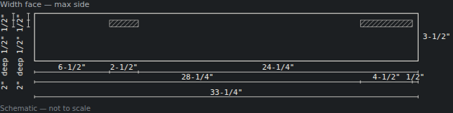
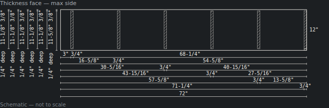

# Browser verification: Add joinery

Phase 2 (follow-up 171), 2026-10-04. Spec: `docs/superpowers/specs/2026-10-04-sloyd-joinery-design.md`.

"Add joinery…" takes the open design and returns a joined copy, saved as a new, unactivated
project. The joints are mortise and tenon, dado or stopped dado, rabbet, and half-lap.

This pass asked whether, on real designs and with the real model, the joints come out
believable, with:
- no new problems;
- a cut list a woodworker can read;
- a cost close to the estimate.

## How this was driven

Claude drove the dev server (`npm run dev -- --host 127.0.0.1 --port 5180`, Chromium, software
GL) with the Playwright MCP, and **the user watched the same browser**.
- **The key:** the user entered it in Settings. It never appeared in chat, a tool call or a file.
- **Every paid run had the user's OK first.**
- **Instrumentation:** a temporary fetch wrapper in the page counted the requests and their
  turn counts. It read request bodies only, never headers.

The dev server stopped once mid-session, when it hit the 30-minute background limit, and was
restarted with a longer one. The reload this caused cleared the Settings dialog before the key
was saved, and the user re-entered the key.

## Run 1: the user's workbench (`fixtures/simple-workbench.sloyd`)

The dialog listed **20 sites**:
- the four legs into the benchtop;
- the 16 rail ends into the legs.

| | |
|---|---|
| Calls | **1**, no repair |
| Cost | **≈ $0.04** (estimate ≈ $0.05) |
| Joints | **16 mortise and tenon**, one per rail end, with 2″ tenons into the 3-1/2″ legs. The four legs under the top stay butt: a top is fastened, not housed (spec §5.3) |
| New problems | **none** |
| Already in the original | the lower shelf's `hangs` (19% coverage at its ends), reported once and not repaired |

How the result came out:
- Each leg carries **four stopped mortises**, 2″ deep and 1/2″ wide.
- Each rail grew 2″ at each end and carries eight tenon-shoulder cuts.
- Tenons entering a leg from adjacent faces miss each other, because each sits in its own
  quadrant of the leg.
- The cut list reads, for example, `1/2" mortise, 2" deep … stopped 28-1/4" short of the min end
  and 1/2" short of the max end`.

## Run 2: a generated bookcase, then Add joinery

- **Generate:** one call, about $0.04, for "a 36in-wide bookcase with five shelves, 3/4in
  plywood case, and a 1/4in plywood back panel set in at the back". The model built the back
  **between** the sides rather than behind them. Its edges butt the sides, so the design had **no
  rabbet site**. The back's top end, though, went into the Top.

| | |
|---|---|
| Sites | 15: top, toe kick and five shelves into each side, plus the back into the Top |
| Calls | **1**, no repair |
| Cost | **≈ $0.04** |
| Joints | **13**: 1 dado and 12 stopped dados (stopped at the front); the toe kick sites stay butt |
| New problems | **none** |

**One finding**, recorded as follow-up 189:
- **What the sheet says:** every shelf housing in the sides prints as **"mortise"**.
- **Why:** each housing is closed at both ends, stopped at the front by choice, while the shelf
  ends 1/2″ short of the sides' back edge.
- **Why it matters:** the geometry is right, but a woodworker would call it a blind dado.

## Run 3: a forced corner collision

A hand-built corner leg had two rails entering adjacent faces at the same height, both centred
on the leg, so tenons longer than 3/4″ cross inside it.

| | |
|---|---|
| Calls | **1**, no repair |
| Cost | **≈ $0.01** |
| Joints | 2 mortise and tenon, at **0.7″**, snapped to 11/16″ with a note |
| New problems | **none** — the model avoided the collision itself, following the prompt's warning |

The piece's own faults were reported once as "already in the original". These were the rails
being unheld and the piece tipping, which is expected for a single leg.

## Verdict

**The user judged the pass good.** Four paid calls cost about $0.13 by the app's estimates
(follow-up 168 still stands: the bill has not been compared).

## What this pass did not show

- **A rabbet on a real design.** The generated bookcase put its back between the sides, so the
  back-panel move, the trim, and the trimming of parts butting it were not seen live. They are
  covered by the unit tests and by the final reviewer's end-to-end scripts.
- **A live repair round.** Nothing triggered one, so the collision → shorter-tenon repair is
  seen only in unit tests (as 177 is for `hangs` and `tips`).
- **A half-lap.** No design with crossing parts was run.

`localStorage` was cleared in the verifying browser afterward and read back empty. The browser
was closed and the dev server stopped.
