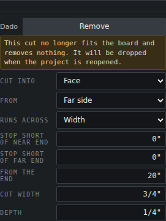
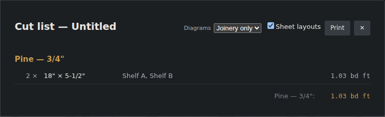

# Browser verification: phantom cut

Follow-up 178, 2026-10-04. This is a bounded round: the design was approved in chat and there
is no spec.

**The problem.** Shrinking a board under one of its cuts can leave that cut removing nothing,
either because its stops now cross or because its offset now lies past the board's end. The 3D
view already showed no cut. The cut list still described it, though: its text, its drawing and
its row grouping. The snap points still offered it too.

**The user chose the remedy:** hide such a cut from the sheet and flag it on its row, but keep
it in the document. Late in the round, after the review, the user added the snap points to
what hides it.

## How this was driven

Claude drove the dev server (`npm run dev -- --host 127.0.0.1 --port 5180`, Chromium, software
GL) with the Playwright MCP, while the user watched the same browser.

**Setup:** two 24″ × 5-1/2″ × 3/4″ shelves. Shelf A carries a 3/4″ dado, 20″ along. Shelf A
was then shrunk to 18″ **through its Length field in Properties**, which leaves the dado past
the board's end.

## What was checked

| Check | Result |
|---|---|
| Properties | The note *"This cut no longer fits the board and removes nothing. It will be dropped when the project is reopened."* appears as a warning box above the cut's fields. The cut is kept, and every field stays editable. |
| Cut list | Shelf B was shrunk to 18″ too, so the two boards were identical apart from the phantom cut. The sheet then reads one row, **2 × 18″ × 5-1/2″, Shelf A, Shelf B**, with no setup line. |
| Snap points | The phantom cut offers none. |
| Growing Shelf A back to 24″ | The note clears, and the dado's setup line returns: `3/4" dado, 1/4" deep … 20" from the length min end`. Its 15 snap points return too. |
| Reload while shrunk | The cut is gone, as the note says it will be. |

**One mistake in the check itself, recorded.** The first comparison put the shrunk Shelf A
(18″) beside an unshrunk Shelf B (24″). The two came out as separate rows only because their
lengths differed. Shrinking B as well isolated the thing under test.

## Verdict

**The user judged the pass good.** The user also saw that the row's label still names the
stored shape ("Dado") while the cut is flagged, and passed it as it is.

## What the review changed

An independent review approved the fix and found five minor issues:

1. A NaN span disagreed with `boardSolids`.
2. The "agrees with the solids" test never called the predicate. That let a deleted lower
   clip survive the tests.
3. The note used `--warn-ink` on its own, which the stylesheet's own comment rejects. It now
   uses the matched warn pill.
4. The snap points still offered the phantom cut.
5. Doc notes for invariants 40 and 18.

All five are addressed. Item 4 was done at the user's word, because the approved design had
said "snap points unchanged".

There were eight mutations in all. Each was caught by at least one test.

`localStorage` was cleared in the verifying browser afterward and read back empty. The browser
was closed and the dev server stopped.
