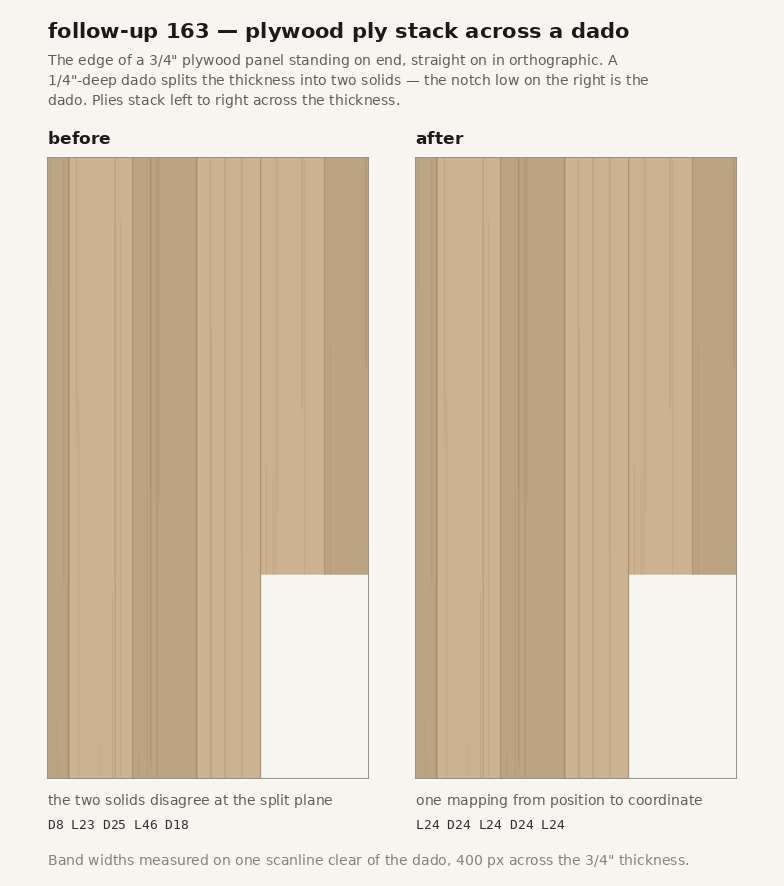

# Browser verification — the ply stack across a cut (follow-up 163)

Dev server, `http://localhost:5199`. Software GL (llvmpipe) as always on this host, and
**26a does not apply**: nothing here rests on undefined shader behaviour. The textures are
drawn CPU-side into a 2D canvas, the geometry is `BoxGeometry`, and every number below came
out of `gl.readPixels` on a flat orthographic view. A screenshot taken here means what it
says.

Production was **not** touched. Exercising this needs a board and a cut, so driving it
against `sloyd.oddbox.tech` would write a document over the user's own — the deployment rule
working, not a gap.

## What was reported

> When a plywood board is on end, the layers don't draw correctly. The middle layer is too
> wide and the outer layers are too narrow.

and then, decisively:

> it's only on plywood boards when I add a cut

The second message is what made this findable. The first read as an orientation bug, and an
orientation bug is what the first pass went looking for — and did not find, correctly.

## The negative result that came first, and why it was not enough

Before the cut was mentioned, three things were measured and all three came back clean:

- **The texture.** `grainTexture('plywood', 'edge')`, read straight off the canvas: ply
  boundary rules at texel rows 0, 102, 205, 307 and 410 of 512. Five equal bands.
- **The UV scale.** `facePlans` over all 24 combinations of posture × rotation × grain, on
  both the edge and end faces: `tileInches[1] === thickness` in every one. The ply stack
  spans the sheet thickness and nothing else, in every orientation.
- **The render.** The board's own modules, drawn straight on at 400 px across the thickness,
  in all 48 face/orientation cases: bands of 78 / 82 / 78 / 83 / 79, equal within 3%.

**That sweep passed with the bug live, and its failure is the transferable part.** It
asserted a *scale* — how much of the tile a face covers — and the defect was a *direction*.
A reversed axis maps `[0, 1]` to `[1, 0]`: same span, same `tileInches`, same min and max,
mirrored content. Every range assertion in `grainTiling.test.ts` had the same blind spot, and
they had had it since the file was written. **A uv-range assertion cannot see a sign.**

## The repro

A 3/4" plywood panel, `posture: 'upright'`, with one 1/4"-deep dado
(`face: 'thickness', from: 'min', across: 'width'`). Rendered straight on at the panel's
edge, 400 px across the thickness, sampling one scanline **clear of the dado** — a place the
cut removes no stock and where the drawing should therefore be identical to the uncut board:

| scanline | before | after |
|---|---|---|
| no cut (control) | `L77 D86 L75 D82 L78` | `L77 D86 L75 D82 L78` |
| dado, below the cut | `D27 L78 D82 L158 D55` | `L73 D83 L78 D82 L78` |
| dado, above the cut | `D27 L78 D82 L158 D55` | `L77 D83 L78 D82 L78` |

`L158` is the whole defect in one number. No correct mapping can produce a light run wider
than one ply (≈80 px here); 158 is two light plies with nothing between them.

## What was actually happening

`boardUVs` builds each solid's UVs from `FACE_AXES`, which recorded **which** world axis each
of `BoxGeometry`'s default UV axes runs along and deliberately discarded **which way**. The
comment said why: *"Signs are irrelevant here — grain is mirror-symmetric, so all that matters
is which axis carries u and which carries v."*

That is true of a whole board and false of a solid, and the distinction is exactly invariant
17: a solid is looked up in the **board's** tiling, so its span is a sub-range. Reversing the
axis puts that sub-range on the wrong side of the face. Read off the geometry, on the panel's
`+X` edge:

| solid | thickness span | world Z | v drawn |
|---|---|---|---|
| outer | 0 → 0.25 | −0.375 → −0.125 | 0.333 → **0** |
| inner | 0.25 → 0.75 | −0.125 → 0.375 | **1** → 0.333 |

The two meet at world Z = −0.125 and hand each other **v = 0 from one side and v = 1 from the
other**. The outermost ply is butted against the innermost: one double-width light band in the
middle of the stack, and a part-ply at each edge — "the middle layer is too wide and the outer
layers are too narrow", exactly.

Three of the box's twelve UV axes run backwards (`+X`'s u, `+Y`'s v, `−Z`'s u), so three of
six faces were affected on every board. It stayed invisible for four reasons at once: an
uncut board shows the whole tile either way; solid wood's figure is near-random, so a mirror
reads as a different board rather than a wrong one; MDF has no structure at all; and plywood's
edge is the one texture in the app where **position within the tile carries meaning**. Plywood
plus a cut is the only combination that shows it.

## The fix

`FACE_AXES` carries the sign alongside the axis — one table, not two that must agree — and
`boardUVs` resolves each corner into a fraction that runs *with* its world axis.

**The ordering is load-bearing and is the half a tidying pass gets backwards.** The sign
belongs to the pair (face, *geometry* axis), which is the same thing as the drawn u/v only
when `swap` is false. So the flip happens **before** the swap; flipping after it applies
`+X`'s u sign to the drawn v — which is precisely the upright faces the defect showed on.

Nothing else changed. The legibility question measured in the first pass — sub-pixel ply
rules, a 7% light/dark step, the mesh outline covering a share of the outer plies — was left
alone on purpose: the user looked and said the layers read as even, and bundling a taste
change into a correctness fix would make both harder to judge.

## Tests, and the mutations they survive

Both new tests build a real `THREE.BoxGeometry` rather than a fixture of vertex positions.
That is the point rather than a convenience: the vertex layout and the default UVs belong to
three.js, a fixture would be this module's own belief about them, and **this module's own
belief about them was the bug** (invariant 23 — bound against a value the thing under test
does not produce). No WebGL is involved; `BoxGeometry` is arithmetic, so this stays inside the
"no unit tests for the r3f viewport" rule.

- **The sign table is read back off the library**, so a three.js bump that changed any of the
  three negatives fails here instead of silently un-fixing the defect.
- **The continuity test asserts one number**: `uv − position / tileInches` is `boardUVs`'
  additive constant, so it must be identical for every vertex of every solid of a board. A
  reversed axis makes it vary *within* a face; a solid placed in the wrong half of the tile
  makes it differ *between* solids. It catches both, and neither in isolation. Run over five
  boards — plywood dadoed in all three postures including a rotated one, an oak rabbet, and an
  uncut control.

Mutation results, on the whole file (52 tests):

| mutation | result |
|---|---|
| no flip at all (the original defect) | **6 fail** |
| flip applied *after* the swap instead of before | **4 fail** |
| one sign wrong in the table (`+Y`'s v) | **5 fail** |
| fix in place | 52 pass |

The middle row is the one worth having: it is the plausible wrong version, it is what the code
looked like before the sign existed at all, and no range assertion in the file notices it.

## Suite and gate

`npm test` — 954 passing across 36 files (947 before; +7 here). `npm run build` clean, which
is the typecheck gate; `npm test` alone does not typecheck.

## What this changes beyond the defect

The fix mirrors the drawn texture on `+X`, `+Y` and `−Z` for **every** board, cut or not. On
plywood edges and on streaky solid-wood faces that is not observable — a mirrored tile is a
tile. On **wood end grain** it is: the ring pattern's pith sits off-tile at v = 1.8, so
flipping `+Y`'s v moves it to −0.8 and the arcs curve the other way. Today a board's `+Y` and
`−Y` end faces disagree with each other; after the fix they agree. That is a small improvement
rather than a regression, but nobody asked for it, so it is recorded here and in the commit
rather than left for someone to find.
