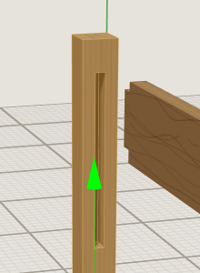
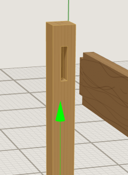
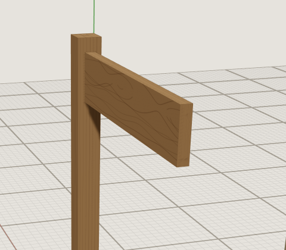
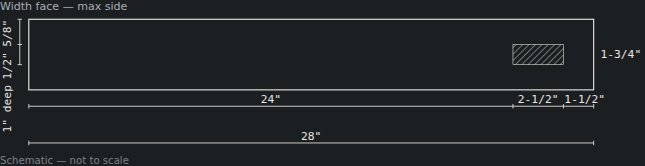
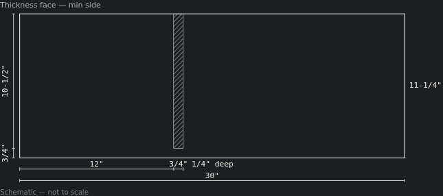
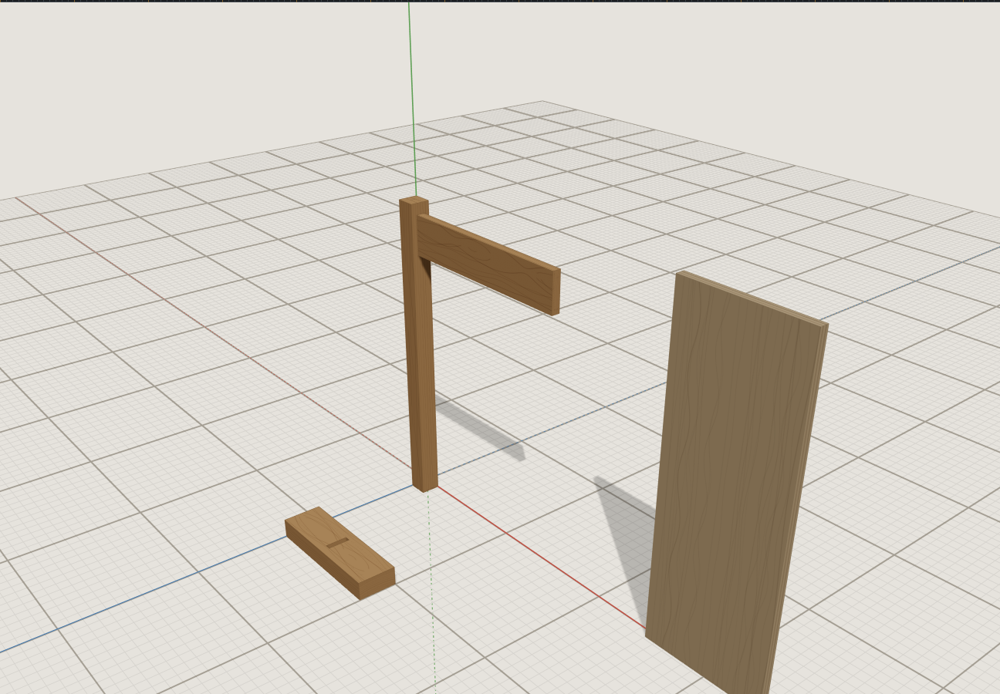

# Browser verification: stopped cuts

The stopped cuts round, 2026-10-04 (spec `docs/superpowers/specs/2026-10-04-sloyd-stopped-cuts-design.md`).

A `Cut` can now stop short of either end of its `across` dimension (`stopMin`/`stopMax`,
schema v7), which makes blind and through mortises, stopped dados and notches possible. This
round is the prerequisite for phase 2 (follow-up 171), whose "overlap accounted for by a cut"
rule needs a mortise to accept a tenon.

This pass asked one question: does a person get the right joint in every place the app shows
it — the 3D view, the cut list's words and drawings, the snap points, and a save and reload?

## How this was driven

Claude drove the dev server (`npm run dev -- --host 127.0.0.1 --port 5180`, Chromium,
software GL) with the Playwright MCP, while **the user watched the same browser**. No paid
calls were made and no key was needed.

**Setup.** The parts were created through the store, imported from the dev server, the same
module instance the app uses:
- a 28″ × 1-3/4″ × 1-3/4″ oak leg, upright;
- an 18″ × 3-1/2″ × 3/4″ rail on edge, with a 1″ four-shoulder tenon made of four rabbets;
- a 30″ × 11-1/4″ plywood case side, with a 3/4″ stopped dado;
- a 12″ × 3-1/2″ × 1-3/4″ block, with a 1/2″ through mortise.

**The leg's mortise was entered through the Properties panel**, which is the thing under
test: Cut into *Edge*, From *Far side*, Runs across *Length*, Stop short of near end `24`,
Stop short of far end `1 1/2`, From the end `5/8`, Cut width `1/2`, Depth `1`. The row's head
label read **mortise** and no error showed.

## What was checked

| Check | Result |
|---|---|
| 3D view of each joint | The leg's mortise is a closed slot near the top. The through block's slot stops 3/4″ short of both edges. The rail's end shows its tenon shoulders. |
| **Edit a stop and undo it, without reloading** | The 3D view redrew both times, faces and edge lines included. Near stop `18` shows a long slot; Ctrl+Z restores the short mortise (images below). This is the defect the final whole-branch review caught — see "What the round's reviews changed". |
| Tenon into mortise via a NEW snap point | The rail's tenon-shoulder midpoint `(7, 24, 0.875)` was snapped to the mortise's end midpoint `(1.75, 24, 0.875)`. The leg only offers that point since this round. The rail landed at x = 0.75. **Zero overlapping stock**, and the rail's stock inside the leg's box was **1.25 in³, exactly the mortise's 1/2 × 2-1/2 × 1**. |
| Cut list setup lines | `1/2" mortise, 1" deep — … running across the length, stopped 24" short of the min end and 1-1/2" short of the max end`; `1/2" through mortise …`; `3/4" stopped dado … stopped 3/4" short of the max end`. The rail's four rabbet lines print exactly as before. |
| Cut list drawings | Each stopped cut's hatch stops where the cut does, with the second leader row or column carrying near stop, length and far stop: `24"`, `2-1/2"`, `1-1/2"` on the leg; `3/4"`, `10-1/2"` on the case side; `3/4"`, `2"`, `3/4"` on the block. No label overlaps. |
| Reload | `sloyd.project.*` holds `version: 7`. All three stopped cuts reloaded with their stops and labels, and the rail kept x = 0.75. |

## Verdict

**The user judged the pass good, which closes the round's live check.**

## What the round's reviews changed

The **final whole-branch review found a critical defect that no per-task review could see.**
`boardUVSignature` (`viewport/grainTiling.ts`), which is BoardMesh's memo key, built its cut
part from a hand-written field list that left out the stops. So a stop edit updated the
label and the cut list while the 3D view kept drawing a through-dado until a reload — the
invariant 15 failure mode, and a breach of the invariant 40 this same round wrote.

The fix moved the compiler-checked field table into `cuts.ts`, as `CUT_GEOMETRY_FIELDS`, and
derived both `cutSignature` and `boardUVSignature` from it. The edit-and-undo row above is
the live confirmation of that fix.

## What this pass did not confirm

- **The snap was driven through the store, not the mouse.** The pass called `grabSnapPoint`
  then `commitSnapMove`, the same actions `MoveTool` calls. The page exposes no camera, so a
  cursor could not be aimed at a projected point. `MoveTool`'s picking is unchanged by this
  round; what changed is which points `snapPointsFor` offers, and that was exercised.
- **The case side's stopped dado was checked only on the cut list drawing.** It is on the
  face away from the default camera, and was not viewed in 3D.
- **Follow-up 178 was recorded, not seen live.** It covers a cut a board shrink has left
  removing nothing still being printed on the cut list.

`localStorage` was cleared in the verifying browser afterward and read back empty. The
browser was closed and the dev server stopped.
