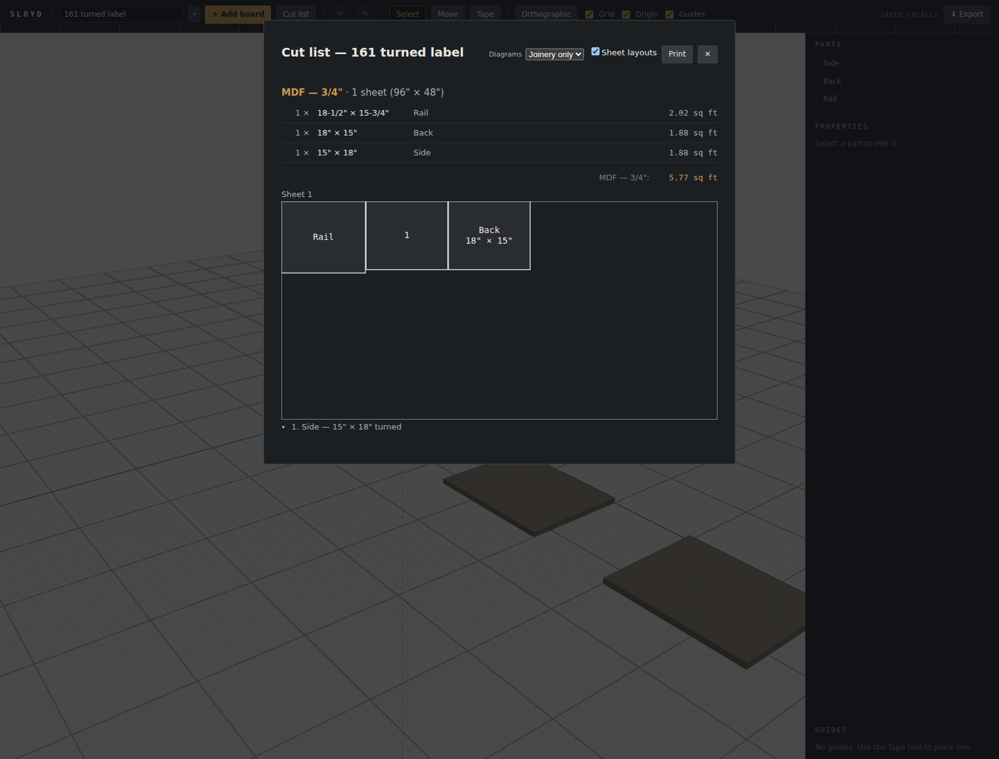

# Browser verification: a turned part demotes to an index

Follow-up 161, the residue follow-up 92 left behind. `fitLabel`'s `name` tier draws
`lines[0]` and nothing else, so a part whose rectangle fits its name but not its dimension
line prints **neither its dimensions nor the word `turned`** — the one tier 92's fix does not
reach. The remedy chosen by the user, from three presented: a turned part that would land on
`name` is demoted to `index` instead, where the key list beside the sheet carries name,
dimensions and the word.

This pass exists for two reasons. The first is invariant 19's standing one: `labelWidth` is
`characters × CHAR_W`, the unit tests assert that arithmetic, and a font whose advance
differs makes the number unrelated to what is drawn while everything stays green. The second
is specific to this round — **the change is a tier decision, and a tier is only observable in
a render.** A unit test can prove `fitLabel` returns `'index'`; only a browser shows that the
rectangle then contains a number, that the key list underneath is the one carrying the lost
information, and that the numbering did not start a second sequence.

Note what changed since 92's pass, which recorded "there are no panel tests for
`SheetLayout`": there are now. `src/panels/SheetLayout.test.tsx` is new in this round, and
the wiring mutation (dropping the `requireDetail` argument at the call site) is caught **only**
by that file — the `fitLabel` unit tests stay green through it. This pass and those tests
cover different things and neither replaces the other.

## How this was driven

Playwright MCP against `npm run dev -- --port 5231`, Chromium, software GL (invariant 26a —
noted for completeness; nothing here touches a WebGL shader).

Seeded directly into the library rather than through the legacy adoption path: a v6 document
written to `sloyd.project.p161` with a matching `sloyd.library.v1` index, then the page
reloaded. Three MDF boards, because `rotate: 'free'` is the only mode in which the packer
turns anything — under `rotate: 'grain'` (plywood) `footprintsOf` returns a single footprint
and `turned` is never true.

The fixture is built so that **the geometry decides nothing**: `Side` and `Back` are laid out
on rectangles of exactly the same size, and differ only in whether the packer turned them.

| Part | length × width | `dims` | Rect (units) | Tier before | Tier after |
|---|---|---|---|---|---|
| `Rail` | 18-1/2" × 15-3/4" | `18-1/2" × 15-3/4"` (17 ch) | 192.71 × 164.06 | `name` | `name` |
| `Side` | 15" × 18" | `15" × 18" turned` (16 ch) | 187.50 × 156.25 | `name` | **`index`** |
| `Back` | 18" × 15" | `18" × 15"` (9 ch) | 187.50 × 156.25 | `full` | `full` |

`Side` is turned because its width exceeds its length, so `footprintsOf`'s shorter-shelf
preference is the flipped orientation. The tiers in the last two columns were computed
against the real `buildNesting` output before the browser was opened, then confirmed in it.

## What the page showed

Read out of the live DOM, not from a screenshot:

```
svg text : ["Rail", "1", "Back", "18\" × 15\""]
key list : ["1. Side — 15\" × 18\" turned"]
rects    : [{x:0, w:192.71, h:164.06}, {x:194.01, w:187.5, h:156.25},
            {x:382.81, w:187.5, h:156.25}]
```



Four things confirmed, each of which a unit test could not see:

1. **The turned part draws a number in its rectangle, not its name.** `Side` is absent from
   the drawn text entirely; `1` sits in its place.
2. **The key entry carries all three things the bare name dropped** — `1. Side — 15" × 18"
   turned`, name, dimensions and the word.
3. **Its unturned twin on an identical rectangle is untouched**, printing both lines. Same
   187.5 × 156.25 box, different result: the flag is what decided it, not the geometry.
4. **The `name` tier still exists.** `Rail` is unturned, its dimension line does not fit, and
   it draws its name alone exactly as before. The change removed a rung for one caller's
   flag, not from the ladder.

The numbering also stayed a single sequence — `1`, with no gap — which is what confirms the
new route into `index` feeds `nextIndex` rather than opening a second counter beside it.

## Recorded, not fixed

**The key list draws a bullet in front of a line that already begins with its own number**,
so the entry reads `• 1. Side — 15" × 18" turned`. `.cutlist-layout-key` sets `color`,
`margin` and `padding-left` but never `list-style`, so the browser's default marker stands.
This is **pre-existing** — the width-driven route into the index tier has always produced it
— but this round makes that tier meaningfully more common, which is what made it visible.
Filed as follow-up **162** rather than folded in: it is a visual change to a printable sheet
and was not part of the design the user approved.

## What this pass did not cover

An actual print-to-PDF render, for the standing reason (follow-ups 70/79/84 — this host's
Playwright exposes no `pdf()`). No print check was run at all this round, and that is a
deliberate narrowing rather than an omission: the round introduces no new element on the
print path. Both the index number and the key line already existed and already printed; what
changed is only how often a part reaches them.

`localStorage` was cleared in the verifying browser afterward, checked rather than assumed.
